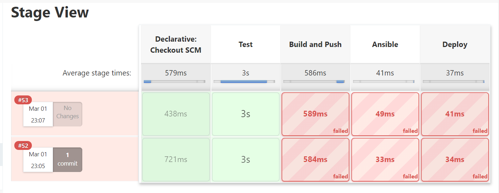

# **World Travel Language Wizard** #

## **1. Project Brief**
This project is an app which will randomly generate one of the four common English phrases for travelling in another language (randomly selected from 10 languages).

The app includes 4 services, frontend, backend, generator01 and generator02. Each service has its own specific function. 

This project is implemented by using the following technologies,

## **2. Service Architecture of this Project**

This app randomly selects one English phrase from 'Welcome', 'Thank You','Good Morning', 'How are you', and translates it in a randomly selected languages, 'German', 'Spanish', 'French', 'Russian', 'Chinese', 'Portuguese','Hindi','Arabic','Japanese', 'Korean'. The app can be accessed via web service. Users can get a different result by fresh the web page or click 'Next' button.

This app will consist of four services, frontend, backend, generator01 and generator02. Theirs functions are described as following,

-Generator01: Generate a random integer between 1 to 10. This number will be converted to a language.
-Generator02: Generate a random integer between 1 to 4. This number will be converted to an English phrase.
-Backend: Convert the random integers generated by generator01 and generator02 to a language an English phrase respectively. Then translate that English phrase in that language.
-Front end: Display the translation from backend.

The following diagram depicts the relationship between four services and how they communicate.

 Generator01 randomly generates an integer with value between 1 and 10. This value will be converted to a language in backend. Generator02 randomly generates an integer with value  between 1 and 4. This value will be converted to an English Phase in backend. Backend receives the random integers from service generator01 and generator02 and translate a random English phrase in a random language. Frontend service presents the translation via web service to the users.

## **3. Implementation** 

One of the core technology used in this project is Docker. User Docker a build the images, run the images in the containers, build the Docker Swarm, and use Docker stack to deploy multiple services in a Swarm.

### **3.1 Docker Image and Container** 

One of the methods to create a Docker image requires a Docker file, which consists of a set of instructions executed in a step by step fashion to build an Docker image.
*source:* 
[https://jfrog.com/knowledge-base/a-beginners-guide-to-understanding-and-building-docker-images/](http://
https://jfrog.com/knowledge-base/a-beginners-guide-to-understanding-and-building-docker-images/
)

For each service requires a specific Dockerfile, the following is an example of Dockerfilr for backend service in this project. 

    FROM python:3.6.8
    COPY . .
    RUN pip3 install Flask requests
    RUN pip3 install flask_wtf
    RUN pip3 install wtforms
    EXPOSE 5000
    ENTRYPOINT ["python3", "app.py"]
After the image is built, it can be uploaded into DockerHub where the images can be stored accessed and shared. For example, the next diagram shows part of images stored in DockerHub for this project. The diagram show four images in DockerHub for the services of backend, generatot02, generator01 and frontend respectively.  

### **3.2 Docker Compose** 
Docker Compose is a tool for Docker that allows you to define and run multiple Docker containers to Docker documentation,

> **Compose is a tool for defining and running multi-container Docker applications. With Compose, you use a YAML file to configure your application’s services. Then, with a single command, you create and start all the services from your configuration. Compose works in all environments: production, staging, development, testing, as well as CI workflows.**

To use Docker Compose, docker-compose.yaml that define the services that make up the app is required. The following is a docker-compose file used in this project.

    version: '3.7'
    services:
      frontend:
    	container_name: frontend
    	build: ./frontend
    	image: python-frontend:latest
    	ports:
    	- target: 5000
      	  published: 5000
      generator01:
    	container_name: generator01
    	build: ./generator01
    	image: python-generator01:latest
    	ports:
    	- target: 5001
      	  published: 5001
    
      generator02:
    	container_name: generator02
    	build: ./generator02
    	image: python-generator02:latest
    	ports:
    	- target: 5002
      	  published: 5002
        
      backend:
    	container_name: backend
    	build: ./backend
    	image: python-backend:latest
    	ports:
    	- target: 5003
      	  published: 5003

### **3.3 NGINX** 
According to Nginx documentation

> A reverse proxy server is a type of proxy server that typically sits behind the firewall in a private network and directs client requests to the appropriate backend server. A reverse proxy provides an additional level of abstraction and control to ensure the smooth flow of network traffic between clients and servers.
> 
> Common uses for a reverse proxy server include:
> 
> **Load balancing** – A reverse proxy server can act as a “traffic cop,” sitting in front of your backend servers and distributing client requests across a group of servers in a manner that maximizes speed and capacity utilization while ensuring no one server is overloaded, which can degrade performance. If a server goes down, the load balancer redirects traffic to the remaining online servers.
> 
> **Web acceleration** – Reverse proxies can compress inbound and outbound data, as well as cache commonly requested content, both of which speed up the flow of traffic between clients and servers. They can also perform additional tasks such as SSL encryption to take load off of your web servers, thereby boosting their performance.
> 
> **Security and anonymity** – By intercepting requests headed for your backend servers, a reverse proxy server protects their identities and acts as an additional defense against security attacks. It also ensures that multiple servers can be accessed from a single record locator or URL regardless of the structure of your local area network.

nginx.conf file is the default file used to configure NGINX. The following is one example of nginx.conf used in this project.

    events {}
    http {
    server {
    listen 80;
    location / {
    proxy_pass http://frontend:5000;
    	   }
    	}
    }

### **3.4 Docker Swarm** 
Docker swarm is a container orchestration tool that enables the user to manage multiple containers deployed across multiple host machines. (source: [https://www.sumologic.com/glossary/docker-swarm/](https://www.sumologic.com/glossary/docker-swarm/))

Swarm can be established by `docker swarm init` run in manager VM and `docker swarm join` in worker VM. VM in the swarm is also referred as node.

### **3.5 Swarm Stack** 
Stacks allow to deploy multiple services in a Swarm from a single configuration file. To create the stack require a configuration file. The following an example configuration file used in the project.

    version: '3.7'
    services:
      frontend:
    	image: sabinaku/frontend_v2 #python-front-and-back_frontend_1
    	deploy:
      		replicas: 2
    	ports:
    	- target: 5000
          published: 5000
          protocol: tcp
          backend:
    
    	image: sabinaku/backend_v2
    	deploy:
      		replicas: 2
    	ports:
    	- target: 5003
          published: 5003
          protocol: tcp
          generator01:
    
    	image: sabinaku/generator01_v2
    	deploy:
      	eplicas: 2
    	ports:
    	- target: 5001
          published: 5001
          protocol: tcp
      generator02:
    
    	image: sabinaku/generator02_v2
    	deploy:
      	replicas: 2
    	ports:
    	- target: 5002
          published: 5002
          protocol: tcp

### **3.6 Jenkins Pipeline** 

Jenkins stage view monitors the whole pipeline of application development stage from source code management, build, testing, to deploying. I divide the pipeline for my project to 4 stages Test, Build, Ansible and Deploying the services. I use the GitHub webhook to automate the pipeline process in Jenlins.
#### Below is a image of Jenkins Stage View

### **3.7 Ansible** 
In this project, I use Ansible as a Deployment tool in a Continuous Integration/Continuous Deployment process using Jenkins Job.

In the CI/CD process, Jenkins is a popular tool for provisioning development/production environments, and application deployment through pipeline flow. However, it's difficult to maintain the application's status in Jenkins, we can use Ansible to play an integral part by executing shell script, enable Jenkins to execute the pipeline flow. 

## **4. Project Planning - Kanban Board* ##
Below is my Kanban board for this project

## **5. Risk Assessment**
The Risk Assessment associated with this project is as below.

## **6. Testing**

The test of this project is tested by Pytest. The function of each service is tested separately. The test code and test result of each service is as following. 

    from unittest.mock import patch
    from flask import url_for, Response, request
    from flask_testing import TestCase
    
    from app import app
    
    class TestBase(TestCase):
    	def create_app(self):
    		return app
    
    class TestResponse(TestBase):
    	def test_frontend(self):
    	with patch("requests.get") as g:
    		g.return_value.text = "World"
    		response = self.client.get(url_for("home"))
    		self.assertEqual(response.status_code,200)
    		self.assertIn(b"World", response.data) 

    from unittest.mock import patch
    from flask import url_for, Response, request
    from flask_testing import TestCase
    import json
    
    from app import app
    
    class TestBase(TestCase):
    	def create_app(self):
    		return app
    
    class TestResponse(TestBase):
    	def test_translate(self):
    		welcome = ['Willkommen', 'Bienvenida, Bienvenido', 'Bienvenue, Bienvenu', \
    			'Добро пожаловать', '欢迎', 'Receber','स्वागत हे','أهلا بك']
    		for i in range(0,8):
    		with patch("requests.get") as g:
    			g.return_value.text = '1'
    			response = self.client.get(url_for("random_generator_temp"))
    			if i==0:
    				self.assertIn(bytes(welcome[i], 'utf-8'), response.data)
    			else:
    				self.assertNotIn(bytes(welcome[i], 'utf-8'), response.data)

    from unittest.mock import patch
    from flask import url_for, Response, request
    from flask_testing import TestCase
    from random import randint
    
    from app import app
    
    class TestBase(TestCase):
    	def create_app(self):
    		return app
    
    class TestResponse(TestBase):
    	def rand_country(self):
        	countries = ['German', 'Spanish', 'French', 'Russian', 'Chinese', 	'Portuguese','Hindi','Arabic','Japanese', 'Korean'] 
        	response = self.client.get(url_for("random_generator"))
        	self.assertIn(countries[int(response.data)-1], countries)

    	def test_country(self):
        	with patch("requests.get") as g:
        	    g.return_value.text = b"1"
        	    response = self.client.get(url_for("random_generator"))
        	    random_output = ['1','2','3','4','5','6','7','8','9','10']
        	    self.assertIn(response.data.decode('utf-8'), random_output)

    from unittest.mock import patch
    from flask import url_for, Response, request
    from flask_testing import TestCase
    
    from app import app
    
    class TestBase(TestCase):
	    def create_app(self):
		    return app
    
    class TestResponse(TestBase):
	    def rand_first_translate (self):
		    first_translate = ['Willkommen', 'Danke', 'Guten Morgen', 'Wie geht es Ihnen']
		    response = self.client.get(url_for("random_generator"))
    		self.assertIn(first_translate[int(response.data.decode('utf-8'))-1], first_translate)
        
    		def rand_tenth_translate (self):
    			tenth_translate = ['어서 오십시오','감사합니다','좋은 아침', '어떻게 지내']
    			response = self.client.get(url_for("random_generator"))
    			self.assertIn(tenth_translate[int(response.data.decode('utf-8'))-1], tenth_translate)
        
    	def test_country(self):
    		with patch("requests.get") as g:
    			g.return_value.text = b"1"
    			response = self.client.get(url_for("random_generator"))
    			random_output = ['1','2','3','4']
    			self.assertIn(response.data.decode('utf-8'), random_output)

The coverage on each service:frontend 95%, backend 91%, generator01: 82, generator02: 82%

## **7. Front End** ##
This project is to create stable and efficient backend infrastructure and use DevOps technologies to automate web based services. The front-end of this project provides the interface with features and functions to get the desired results. The demo of the Fronend of the application is as follows.

Here are screenshots of my app when running:

## **8. Evaluation** ##
### Challenges
This project involves 4 VM and 4 Services with very complicated configurations and settings between different VM, applications etc. The files and codes need to be organised and maintained well.  

### Improvements
The functions and languages I developed for the applications is limited due to the time constraint; however, this application can be further developed to a commercial product for education or business use.

## **9. Licensing** ##
Permission is hereby granted, free of charge, to any person obtaining a copy of this software and associated documentation files (the "Software"), to deal in the Software without restriction, including without limitation the rights to use, copy, modify, merge, publish, distribute, sublicense, and/or sell copies of the Software, and to permit persons to whom the Software is furnished to do so, subject to the following conditions:
This permission notice shall be included in all copies or substantial portions of the Software.
THE SOFTWARE IS PROVIDED "AS IS", WITHOUT WARRANTY OF ANY KIND, EXPRESS OR IMPLIED, INCLUDING BUT NOT LIMITED TO THE WARRANTIES OF MERCHANTABILITY, FITNESS FOR A PARTICULAR PURPOSE AND NONINFRINGEMENT. IN NO EVENT SHALL THE AUTHORS OR COPYRIGHT HOLDERS BE LIABLE FOR ANY CLAIM, DAMAGES OR OTHER LIABILITY, WHETHER IN AN ACTION OF CONTRACT, TORT OR OTHERWISE, ARISING FROM, OUT OF OR IN CONNECTION WITH THE SOFTWARE OR THE USE OR OTHER DEALINGS IN THE SOFTWARE.
## **10. Acknowledgements** ##
I would like to thank my trainers for providing me with a good understanding and quality of teaching before and during the project..

## **11.Author** ##
## Sabina Ku
